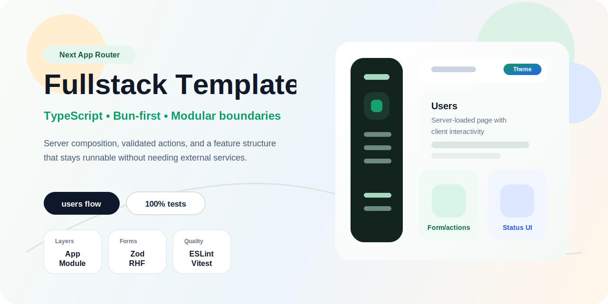
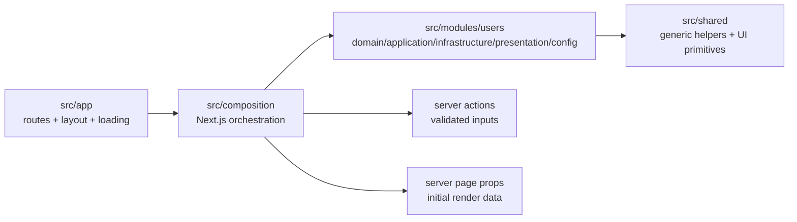
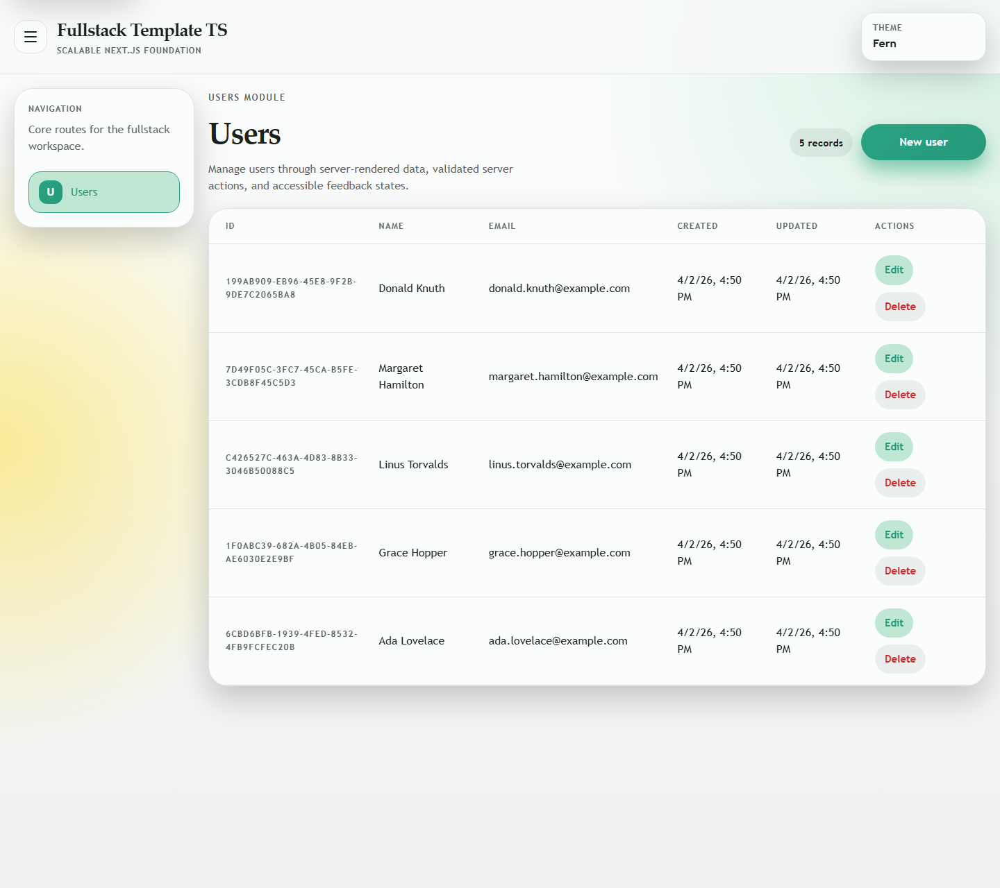
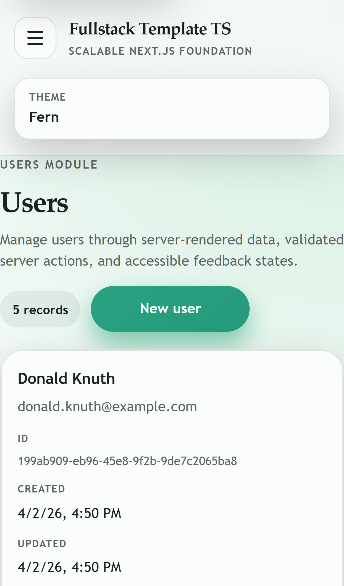
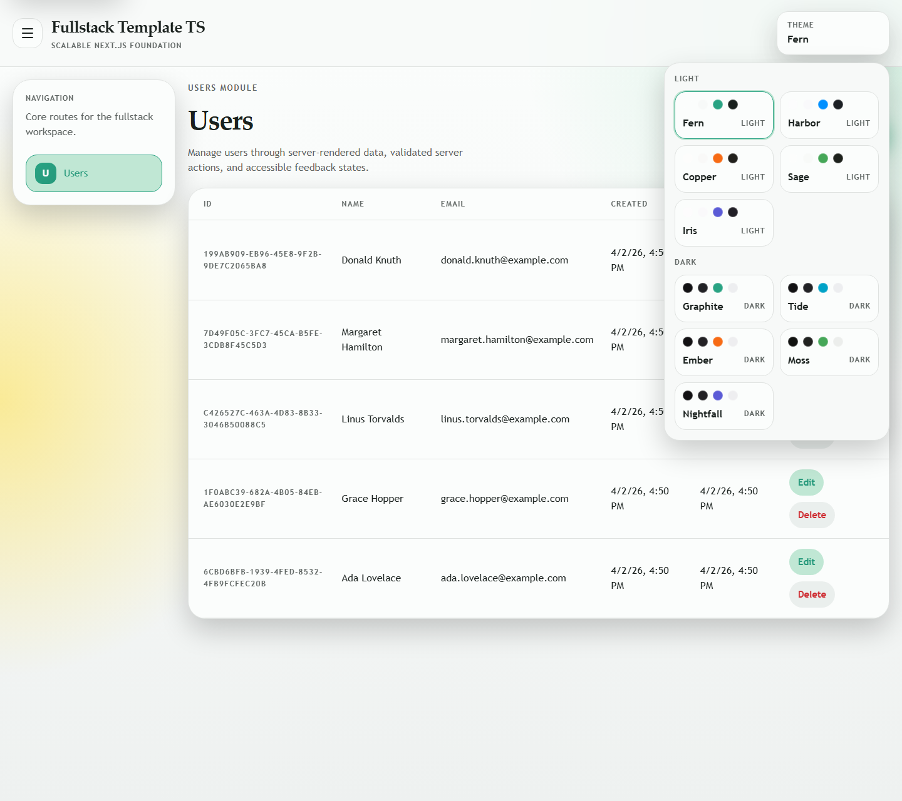
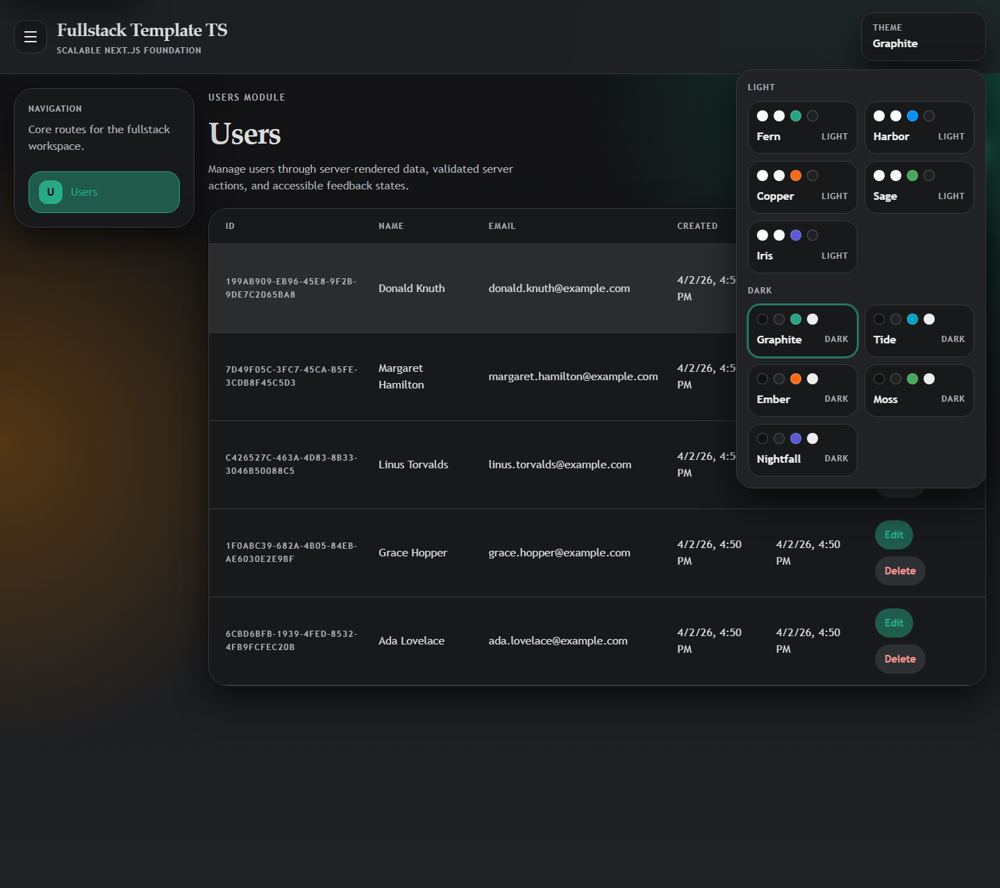

<p align="center">
  
</p>

<h1 align="center">Fullstack Template in TypeScript</h1>

<p align="center">
  Production-oriented Next.js App Router template with strict TypeScript, explicit module boundaries, validated server actions, and a theme-ready UI shell.
</p>

<p align="center">
  
  
  
  
  
</p>

<p align="center">
  
  
  
</p>

<p align="center">
  <a href="#architecture-at-a-glance">Architecture</a> •
  <a href="#real-ui-preview">Real UI</a> •
  <a href="#theme-selector">Theme Selector</a> •
  <a href="#english">English</a> •
  <a href="#espanol">Español</a>
</p>

| Focus                        | Runtime                 | Example flow                                                       | Quality gates                                               |
|------------------------------|-------------------------|--------------------------------------------------------------------|-------------------------------------------------------------|
| Next.js fullstack foundation | Bun-first, npm fallback | `/users` CRUD with server-rendered initial data and server actions | ESLint, dependency-cruiser, Vitest, dprint, `100%` coverage |

## Architecture At A Glance



## Real UI Preview

<table>
  <tr>
    <td width="70%" valign="top">
      <strong>Desktop</strong><br />
      
    </td>
    <td width="30%" valign="top">
      <strong>Mobile</strong><br />
      
    </td>
  </tr>
</table>

## Theme Selector

<table>
  <tr>
    <td width="50%" valign="top">
      <strong>Light theme</strong><br />
      
    </td>
    <td width="50%" valign="top">
      <strong>Dark theme</strong><br />
      
    </td>
  </tr>
</table>

<a id="english"></a>

<details open>
<summary><strong>English</strong></summary>

> [!NOTE]
> Bun is the primary package manager and local runtime for this repository. npm remains a fallback when Bun is unavailable.

Production-oriented fullstack template built with Next.js App Router, strict TypeScript, Bun, and explicit module boundaries.
The current template ships one complete `users` flow running entirely inside the repository through server-rendered page loading, server actions, and an in-memory repository.

### Quick Facts

| Area                   | Details                                                                  |
|------------------------|--------------------------------------------------------------------------|
| Repository goal        | Keep a real fullstack baseline runnable without external services        |
| Architectural boundary | `app` -> `composition` -> `modules` -> `shared`                          |
| Example feature        | `users` CRUD rendered on the server and completed through server actions |
| UI foundation          | Responsive shell, theme selector, shared primitives, status pages        |

### What Is Included

- Next.js App Router as the integrated fullstack runtime
- Root route `/` redirecting to `/users`
- Feature module structure with `domain`, `application`, `infrastructure`, `presentation`, and `config`
- Domain-level ports so infrastructure stays replaceable
- Server composition split between `src/composition/server` and `src/composition/client`
- In-memory CRUD with an empty initial store and validated server actions
- Responsive app shell with sidebar navigation, theme selector, and shared UI primitives
- Route-level metadata, accessible status pages, skip link, and reduced-motion-friendly interactions
- Bun-first local workflow with npm fallback only when Bun is unavailable
- Multi-stage Docker packaging with Bun-based build steps and Next.js standalone runtime output
- Radix Colors theme foundation
- React Hook Form and Zod for forms and validation
- ESLint, `eslint-plugin-boundaries`, dependency-cruiser, Vitest, React Testing Library, and dprint
- Type-checked production build plus architectural dependency enforcement
- Coverage thresholds fixed at `100%` on the included source files

### Stack

| Runtime                                                | UI             | Validation               | Quality                                                                                                 |
|--------------------------------------------------------|----------------|--------------------------|---------------------------------------------------------------------------------------------------------|
| `Bun`, `Node.js 20+`, `Next.js App Router`, `React 19` | `Radix Colors` | `Zod`, `React Hook Form` | `Vitest`, `React Testing Library`, `ESLint`, `dependency-cruiser`, `eslint-plugin-boundaries`, `dprint` |

### Structure

```text
src/
  app/
    users/
    providers/
    theme/
    AppShell.tsx
  composition/
    client/
    server/
      users/
  modules/
    users/
      domain/
        errors/
        ports/
      application/
        use-cases/
      infrastructure/
        in-memory/
      presentation/
        components/
        forms/
        hooks/
      config/
  shared/
    domain/
    ui/
tests/
  unit/
  integration/
  ui/
  setup/
```

### Layers

#### App

This is the global Next.js runtime surface. It owns route files, metadata, loading/error/not-found boundaries, layout, providers, theme setup, and the app shell.
In the template:

- `src/app/page.tsx` redirects `/` to `/users`
- `src/app/users/page.tsx` builds the route from server-composed props and renders `UsersClient`
- `src/app/layout.tsx`, `AppShell.tsx`, `providers/`, and `theme/` own the global UI wiring

#### Composition

This layer bridges Next.js runtime concerns with module code. Keep it thin and orchestration-only.
In the template:

- `src/composition/server/users/createUsersPageProps.ts` prepares initial server-rendered props
- `src/composition/server/users/usersActions.ts` exposes validated server actions
- `src/composition/client/navigation.ts` centralizes app navigation metadata

#### Module Domain

This is where pure business types and rules live. It must not depend on Next.js, React, server actions, forms, or storage details.
In the example:

- `User` defines the entity and write contracts
- `UserNotFoundError` models an explicit domain failure
- `UserRepository` defines the persistence port consumed by the use cases

#### Module Application

This layer coordinates use cases against domain contracts.
In the example:

- `ListUsers`
- `GetUserById`
- `CreateUser`
- `UpdateUser`
- `DeleteUser`

#### Module Infrastructure

This layer implements concrete adapters and storage details.
In the template:

- `InMemoryUserRepository`
- empty `inMemoryUsersStore`

#### Module Presentation

This layer contains UI-facing contracts, pages, components, hooks, and form schemas.
In the template:

- `UsersClient` drives the interactive users flow
- `UsersView` renders the visible surface
- `useUsersPage` coordinates local UI behavior
- `UserFormSchema` validates form input

#### Module Config

This is the module-local composition root.
In the template:

- `createUsersModule.ts` wires a concrete `UserRepository` implementation to the use cases

#### Shared

This area contains generic helpers and reusable UI primitives with no feature ownership.
In the template:

- `getErrorMessage` normalizes unknown errors
- `Button` and `TextField` are reusable UI building blocks

### How To Run It

```bash
bun install
bun run dev
```

Available scripts:

| Purpose           | Bun                     | npm fallback            |
|-------------------|-------------------------|-------------------------|
| Install           | `bun install`           | `npm install`           |
| Dev server        | `bun run dev`           | `npm run dev`           |
| Production build  | `bun run build`         | `npm run build`         |
| Production server | `bun run start`         | `npm run start`         |
| Tests             | `bun run test`          | `npm run test`          |
| Coverage          | `bun run test:coverage` | `npm run test:coverage` |
| Lint              | `bun run lint`          | `npm run lint`          |
| Format check      | `bun run format`        | `npm run format`        |
| Format write      | `bun run format:write`  | `npm run format:write`  |

### Docker

The template includes a multi-stage Docker build that uses Bun for dependency installation and build steps, then runs the Next.js standalone server on Node.js.

```bash
docker build -t fullstack-template-ts .
docker run --rm -p 3000:3000 fullstack-template-ts
```

The container binds `0.0.0.0:3000` by default.

### Route Surface

| Route    | Behavior              |
|----------|-----------------------|
| `/`      | Redirects to `/users` |
| `/users` | Users CRUD page       |

Initial page data is loaded on the server, and create/update/delete flows go through Next.js server actions inside the same repository.

### Environment

> [!TIP]
> `.env.example` exists only to document that the default setup requires no environment variables.

### State And Effects

- initial page reads happen through server composition helpers
- create, update, and delete flows go through validated server actions
- form state belongs to React Hook Form
- short-lived interactive UI state stays in client hooks and components
- `useEffect` is reserved for real browser synchronization such as listeners or imperative APIs, not routine data loading

### SEO, Accessibility, And UI Quality

- layout-level and route-level metadata are part of the repository contract
- every screen keeps a clear primary heading and descriptive copy
- semantic HTML comes first, with ARIA used to enhance structure rather than replace it
- desktop and mobile layouts are both considered part of the default contract
- the app shell includes a skip link, visible focus states, keyboard-usable navigation, and theme controls
- loading, empty, error, and destructive states are explicit in the users flow
- user-facing runtime errors stay generic instead of leaking low-level technical details into the visible UI
- theme and motion behavior respect reusable tokens and reduced-motion expectations
- shared and app-level styles should not accumulate orphan selectors

### Quality Gates And Enforcement

- `bun run format` uses `dprint`
- `bun run lint` runs ESLint plus `dependency-cruiser`
- `eslint-plugin-boundaries` and `dependency-cruiser` protect the documented layer rules
- `bun run build` runs `next build` and `tsc -p tsconfig.check.json --noEmit`
- architectural or command changes should update the enforcement config and documentation together

### Testing And Coverage

The repository uses:

- `tests/unit` for domain, use cases, composition helpers, and repository behavior
- `tests/integration` for module and server-action flows
- `tests/ui` for component and hook behavior
- `tests/setup` for shared test setup

Coverage is treated as a contract.
`bun run test:coverage` enforces `100%` statements, branches, functions, and lines on the included source files.
Coverage exclusions should stay narrow and limited to pure type-only contracts when strictly necessary.
Test-only resets, fixtures, mocks, and similar helpers should live under `tests/**` or shared test setup, not under `src/**`.

### How To Extend The Template

1. Create a new module under `src/modules/<feature>`.
2. Put business types and rules in `domain`.
3. Add use cases in `application`.
4. Implement concrete adapters in `infrastructure`.
5. Wire the module in `config`.
6. Add pages, components, hooks, and form schemas in `presentation`.
7. Add server-side page-prop builders or server actions under `src/composition/server/<feature>` when needed.
8. Mount the route from `src/app`.

### What To Replace In A Real Project

- `InMemoryUserRepository` with a database or external service adapter
- `inMemoryUsersStore` with real persistence
- the `UserRepository` port stable while swapping infrastructure behind it
- the `users` module with your real bounded contexts or product features
- the default metadata, copy, and navigation labels with your product language
- the initial server composition with the runtime boundaries your app actually needs

### Design Decisions

- Next.js runtime concerns stay in `src/app`
- module boundaries are explicit so feature growth stays readable
- composition is manual to keep replacement points obvious
- domain ports keep infrastructure replaceable without leaking concrete adapters into use cases
- server actions validate input at the edge before calling use cases
- in-memory persistence keeps the template runnable with zero external services
- the route surface starts intentionally small so the example stays focused
- runtime code should clean up listeners, subscriptions, timers, and similar resources, and should avoid unbounded process-global caches or stores unless that boundary is intentional

</details>

<a id="espanol"></a>

<details>
<summary><strong>Español</strong></summary>

> [!NOTE]
> Bun es el package manager y runtime local principal de este repositorio. npm queda como fallback cuando Bun no está disponible.

Template fullstack orientado a producción con Next.js App Router, TypeScript estricto, Bun y límites modulares explícitos.
La versión actual trae un flujo completo de `users` que corre íntegramente dentro del repositorio mediante carga server-side, server actions y un repositorio in-memory.

### Resumen Rápido

| Área                     | Detalle                                                                        |
|--------------------------|--------------------------------------------------------------------------------|
| Objetivo del repositorio | Mantener una base fullstack real ejecutable sin servicios externos             |
| Límite arquitectónico    | `app` -> `composition` -> `modules` -> `shared`                                |
| Feature de ejemplo       | CRUD de `users` renderizado en servidor y completado con server actions        |
| Base de UI               | Shell responsive, selector de tema, primitivas compartidas y páginas de estado |

### Qué Incluye

- Next.js App Router como runtime fullstack integrado
- Ruta raíz `/` redirigiendo a `/users`
- Estructura modular por feature con `domain`, `application`, `infrastructure`, `presentation` y `config`
- Puertos a nivel dominio para que infraestructura siga siendo reemplazable
- Composición de servidor y cliente separada entre `src/composition/server` y `src/composition/client`
- CRUD in-memory con store inicial vacío y server actions validadas
- App shell responsive con navegación lateral, selector de tema y primitivas UI compartidas
- Metadata por layout y por ruta, páginas de estado accesibles, skip link e interacciones compatibles con reduced motion
- Flujo local Bun-first con fallback a npm solo cuando Bun no está disponible
- Empaquetado Docker multi-stage con build en Bun y runtime Next.js standalone
- Base visual con Radix Colors
- React Hook Form y Zod para formularios y validación
- ESLint, `eslint-plugin-boundaries`, dependency-cruiser, Vitest, React Testing Library y dprint
- Build de producción con chequeo de tipos y enforcement arquitectónico de dependencias
- Thresholds de cobertura fijados en `100%` sobre los archivos fuente incluidos

### Stack

| Runtime                                                | UI             | Validación               | Calidad                                                                                                 |
|--------------------------------------------------------|----------------|--------------------------|---------------------------------------------------------------------------------------------------------|
| `Bun`, `Node.js 20+`, `Next.js App Router`, `React 19` | `Radix Colors` | `Zod`, `React Hook Form` | `Vitest`, `React Testing Library`, `ESLint`, `dependency-cruiser`, `eslint-plugin-boundaries`, `dprint` |

### Estructura

```text
src/
  app/
    users/
    providers/
    theme/
    AppShell.tsx
  composition/
    client/
    server/
      users/
  modules/
    users/
      domain/
        errors/
        ports/
      application/
        use-cases/
      infrastructure/
        in-memory/
      presentation/
        components/
        forms/
        hooks/
      config/
  shared/
    domain/
    ui/
tests/
  unit/
  integration/
  ui/
  setup/
```

### Capas

#### App

Es la superficie global del runtime de Next.js. Acá viven archivos de rutas, metadata, boundaries de loading/error/not-found, layout, providers, theming y el app shell.
En el template:

- `src/app/page.tsx` redirige `/` hacia `/users`
- `src/app/users/page.tsx` arma la ruta a partir de props compuestas en servidor y renderiza `UsersClient`
- `src/app/layout.tsx`, `AppShell.tsx`, `providers/` y `theme/` son dueños del wiring global de UI

#### Composition

Esta capa conecta las preocupaciones del runtime de Next.js con el código modular. Debe mantenerse fina y orientada a orquestación.
En el template:

- `src/composition/server/users/createUsersPageProps.ts` prepara las props iniciales renderizadas en servidor
- `src/composition/server/users/usersActions.ts` expone server actions validadas
- `src/composition/client/navigation.ts` centraliza la metadata de navegación

#### Module Domain

Acá viven los tipos y reglas de negocio puras. No debe depender de Next.js, React, server actions, formularios ni detalles de storage.
En el ejemplo:

- `User` define la entidad y los contratos de escritura
- `UserNotFoundError` modela una falla de dominio explícita
- `UserRepository` define el puerto de persistencia que consumen los casos de uso

#### Module Application

Coordina casos de uso contra contratos del dominio.
En el ejemplo:

- `ListUsers`
- `GetUserById`
- `CreateUser`
- `UpdateUser`
- `DeleteUser`

#### Module Infrastructure

Implementa adapters concretos y detalles de persistencia.
En el template:

- `InMemoryUserRepository`
- `inMemoryUsersStore` vacío

#### Module Presentation

Contiene contratos orientados a UI, páginas, componentes, hooks y schemas de formularios.
En el template:

- `UsersClient` resuelve el flujo interactivo de usuarios
- `UsersView` renderiza la superficie visible
- `useUsersPage` coordina el comportamiento local de UI
- `UserFormSchema` valida la entrada del formulario

#### Module Config

Es la raíz de composición local del módulo.
En el template:

- `createUsersModule.ts` conecta una implementación concreta de `UserRepository` con los casos de uso

#### Shared

Acá van helpers genéricos y primitivas UI reutilizables sin dueño de negocio.
En el template:

- `getErrorMessage` normaliza errores desconocidos
- `Button` y `TextField` son bloques UI reutilizables

### Cómo Correrlo

```bash
bun install
bun run dev
```

Scripts disponibles:

| Propósito              | Bun                     | npm fallback            |
|------------------------|-------------------------|-------------------------|
| Instalar               | `bun install`           | `npm install`           |
| Dev server             | `bun run dev`           | `npm run dev`           |
| Build de producción    | `bun run build`         | `npm run build`         |
| Servidor de producción | `bun run start`         | `npm run start`         |
| Tests                  | `bun run test`          | `npm run test`          |
| Cobertura              | `bun run test:coverage` | `npm run test:coverage` |
| Lint                   | `bun run lint`          | `npm run lint`          |
| Check de formato       | `bun run format`        | `npm run format`        |
| Escritura de formato   | `bun run format:write`  | `npm run format:write`  |

### Docker

El template incluye un build Docker multi-stage que usa Bun para instalar dependencias y compilar, y luego ejecuta el servidor standalone de Next.js sobre Node.js.

```bash
docker build -t fullstack-template-ts .
docker run --rm -p 3000:3000 fullstack-template-ts
```

El contenedor expone `0.0.0.0:3000` por defecto.

### Superficie De Rutas

| Ruta     | Comportamiento          |
|----------|-------------------------|
| `/`      | Redirige a `/users`     |
| `/users` | Página CRUD de usuarios |

La carga inicial de la página ocurre en servidor, y los flujos de crear/editar/eliminar pasan por server actions de Next.js dentro del mismo repositorio.

### Entorno

> [!TIP]
> `.env.example` existe solo para documentar que la configuración por defecto no requiere variables de entorno.

### Estado Y Efectos

- las lecturas iniciales de página ocurren mediante helpers de composición server-side
- los flujos de crear, editar y eliminar pasan por server actions validadas
- el estado del formulario pertenece a React Hook Form
- el estado interactivo de corta duración queda en hooks y componentes cliente
- `useEffect` queda reservado para sincronización real con el navegador, como listeners o APIs imperativas, no para carga rutinaria de datos

### SEO, Accesibilidad Y Calidad De UI

- la metadata a nivel layout y ruta forma parte del contrato del repositorio
- cada pantalla mantiene un heading principal claro y copy descriptivo
- primero va el HTML semántico, y ARIA se usa para reforzar estructura, no para reemplazarla
- desktop y mobile forman parte del contrato por defecto del template
- el app shell incluye skip link, focus visible, navegación usable por teclado y controles de tema accesibles
- los estados de loading, empty, error y acciones destructivas están explícitos en el flujo de usuarios
- los errores runtime visibles para el usuario se mantienen genéricos en vez de exponer detalles técnicos de bajo nivel
- el sistema de temas y movimiento respeta tokens reutilizables y reduced motion
- los estilos compartidos y de app no deben acumular selectores huérfanos

### Quality Gates Y Enforcement

- `bun run format` usa `dprint`
- `bun run lint` ejecuta ESLint más `dependency-cruiser`
- `eslint-plugin-boundaries` y `dependency-cruiser` protegen las reglas de capas documentadas
- `bun run build` ejecuta `next build` y `tsc -p tsconfig.check.json --noEmit`
- si cambian reglas arquitectónicas o comandos, deben actualizarse juntos los configs de enforcement y la documentación

### Testing Y Cobertura

El repositorio usa:

- `tests/unit` para dominio, casos de uso, helpers de composición y comportamiento del repositorio
- `tests/integration` para flujos del módulo y server actions
- `tests/ui` para comportamiento de componentes y hooks
- `tests/setup` para setup compartido de pruebas

La cobertura está tratada como contrato.
`bun run test:coverage` exige `100%` de statements, branches, functions y lines sobre los archivos fuente incluidos.
Las exclusiones de cobertura deben ser mínimas y limitarse a contratos puramente tipados cuando sea estrictamente necesario.
Los resets, fixtures, mocks y helpers equivalentes exclusivos de testing deben vivir en `tests/**` o en el setup de pruebas, no en `src/**`.

### Cómo Extender El Template

1. Crear un nuevo módulo en `src/modules/<feature>`.
2. Poner tipos y reglas de negocio en `domain`.
3. Agregar casos de uso en `application`.
4. Implementar adapters concretos en `infrastructure`.
5. Conectar el módulo en `config`.
6. Agregar páginas, componentes, hooks y schemas de formularios en `presentation`.
7. Agregar builders de props server-side o server actions en `src/composition/server/<feature>` cuando haga falta.
8. Montar la ruta desde `src/app`.

### Qué Reemplazar En Un Proyecto Real

- `InMemoryUserRepository` por un adapter de base de datos o servicio externo
- `inMemoryUsersStore` por persistencia real
- mantener estable el puerto `UserRepository` mientras cambia la infraestructura detrás
- el módulo `users` por tus bounded contexts o features reales
- la metadata, el copy y las etiquetas de navegación por el lenguaje de tu producto
- la composición server-side inicial por los límites runtime que realmente necesite tu app

### Decisiones De Diseño

- las preocupaciones del runtime de Next.js quedan en `src/app`
- los límites modulares son explícitos para que el crecimiento por feature siga siendo legible
- la composición es manual para que los puntos de reemplazo sean obvios
- los puertos de dominio mantienen reemplazable la infraestructura sin filtrar adapters concretos hacia los casos de uso
- las server actions validan la entrada en el borde antes de llamar casos de uso
- la persistencia in-memory permite correr el template sin servicios externos
- la superficie de rutas arranca deliberadamente chica para mantener el ejemplo enfocado
- el código de runtime debe limpiar listeners, suscripciones, timers y recursos equivalentes, y debe evitar caches o stores globales sin cota salvo que ese límite sea intencional

</details>
